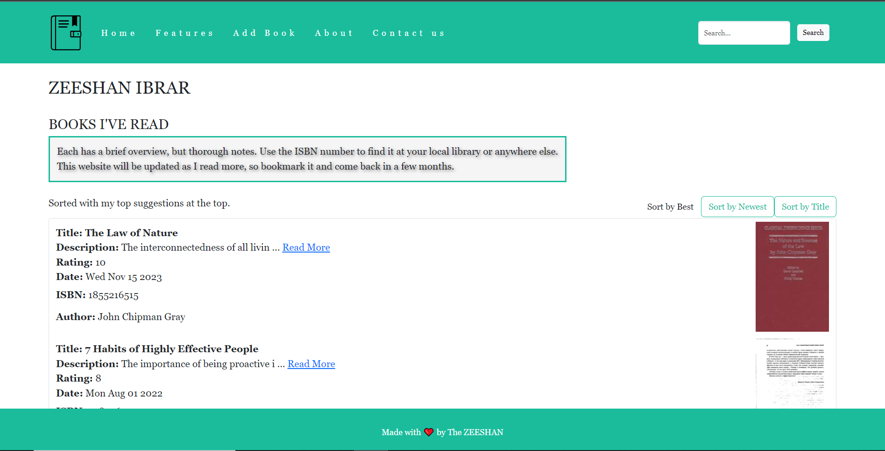
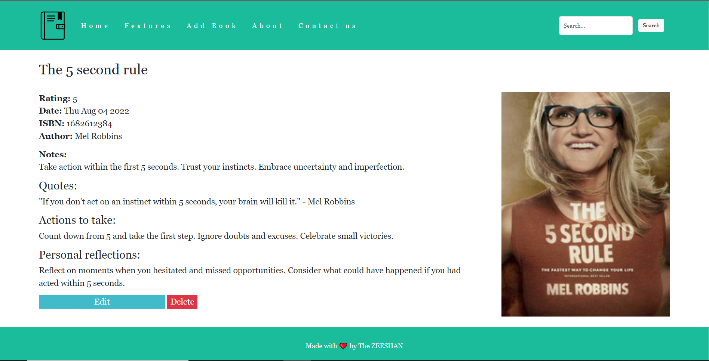
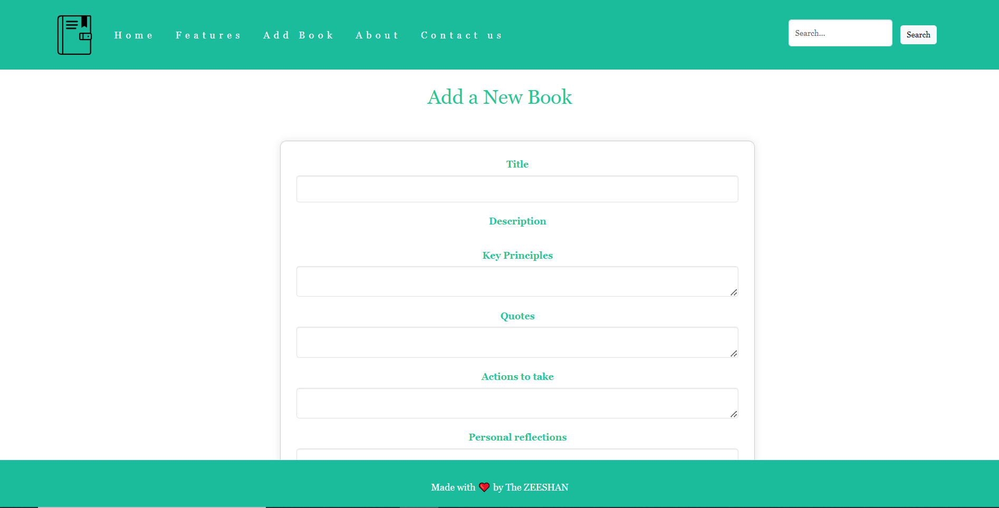
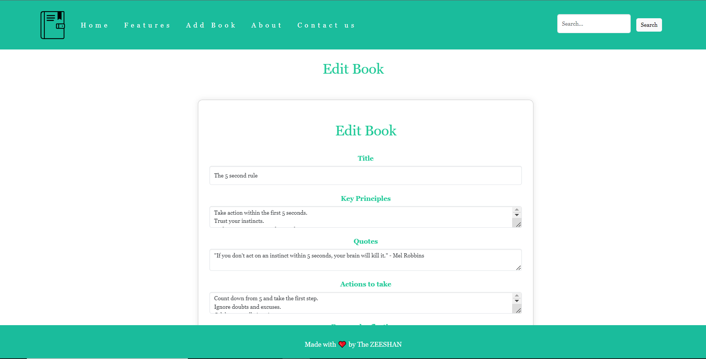

# BookNotes Web Application

BookNotes is a web application designed to manage and organize your book collection. It provides features for adding, editing, and deleting book entries, as well as fetching additional details about each book from an external API. The application is built using Express.js, PostgreSQL for the database, and Bootstrap for styling.

## Features

- **Home Page**: View a list of books with details fetched from an external API.

- **Book Details**: Get detailed information about a specific book, including cover image, author, and ISBN.

- **Add Book**: Add a new book to the collection with key principles, quotes, actions to take, personal reflections, rating, and submission date.

- **Edit Book**: Modify existing book details, updating specific fields.
- **Delete Book**: Remove a book from the collection.
- **Search**: Search for books by title or author.

## Installation

1. Clone the repository:

```bash
git clone <repository-url>
```

2. Dependencies

- Express.js: Web application framework.
- PostgreSQL: Database for storing book information.
- Bootstrap: Front-end framework for styling.

3. Install dependencies
```bash
npm install
```

4. Set up the PostgreSQL database. Create a database named "Book" and update the connection details in app.js.

5. Run the application
```bash
npm start
```
6. Open your browser and navigate to http://localhost:3000 to use BookNotes.


